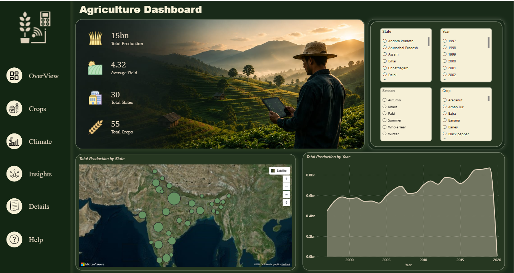
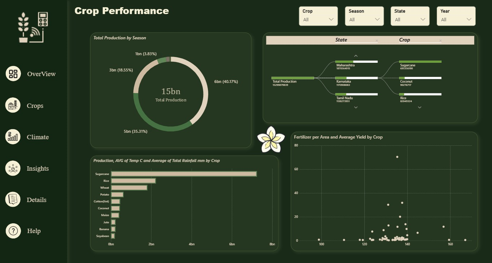
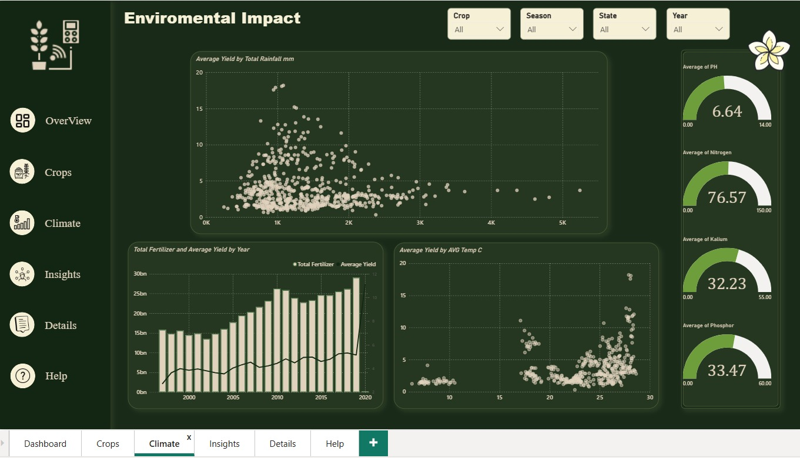
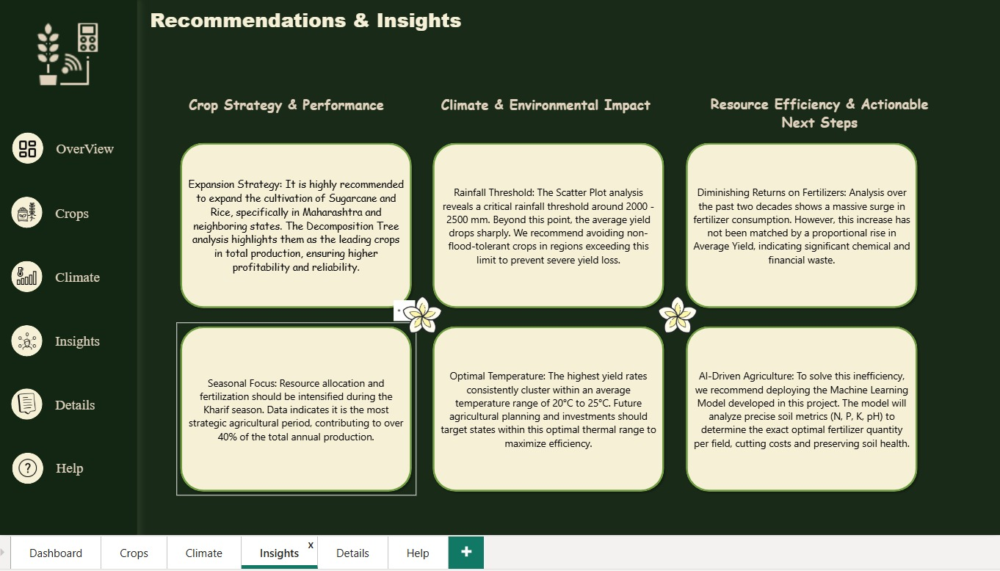
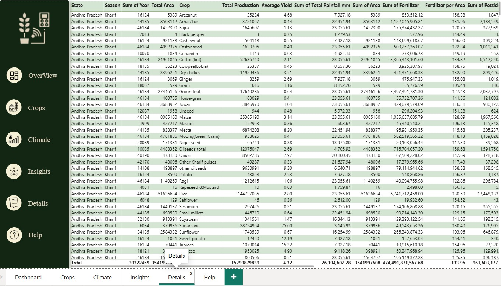
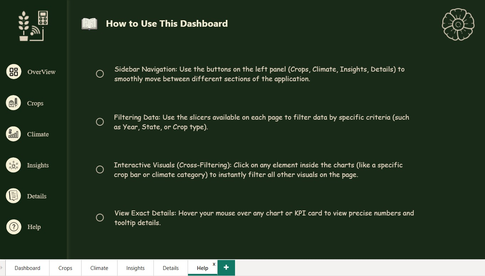
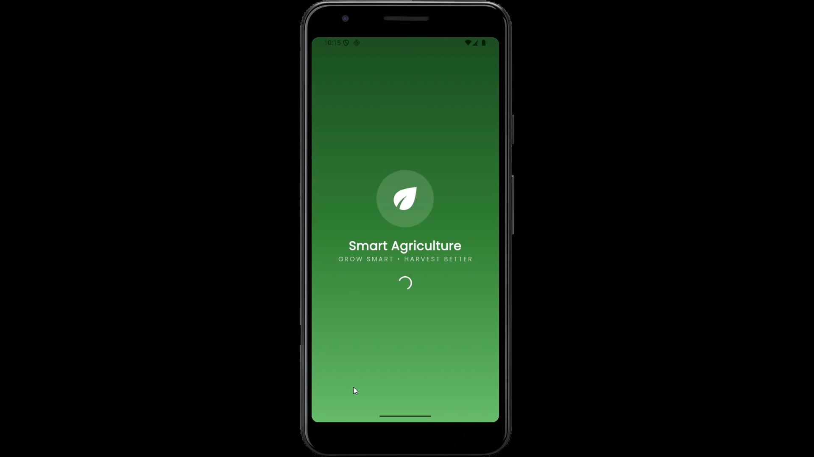
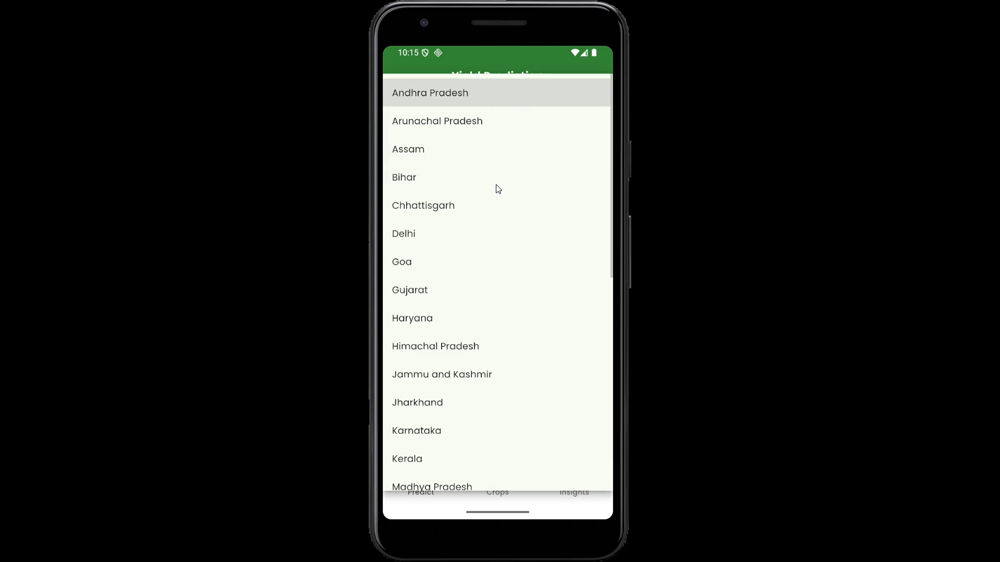
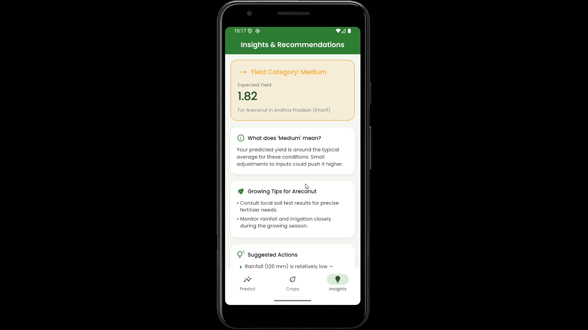

# 🌾 Smart Agriculture Portfolio — Crop Yield Prediction

An end-to-end data project that takes a raw crop-production dataset all the way from raw crop-production data to a complete Smart Agriculture solution:
Data Cleaning → EDA → Machine Learning → Power BI Dashboard → FastAPI Backend → Flutter Mobile Application.

---

# 📁 Project Structure

```text
project_output/
|
├── backend/
│   ├── main.py
│   └── models/
│
├── dashboard/
│   └── screenshots/
│       ├── dashboard1.png
│       ├── dashboard2.png
│       ├── dashboard3.png
│       ├── dashboard4.png
│       ├── dashboard5.png
│       └── dashboard6.png
│
├── flutter_app_new/
│   ├── lib/
│   ├── pubspec.yaml
│   └── screenshots/
│       ├── splash.png
│       ├── predict.png
│       ├── crops.png
│       └── insights.png
│
├── Agriculture Dashboard Final Project.pbix
├── Agriculture_project_final.ipynb
├── README.md
└── .gitignore
```

---

# 1. Notebook — `Agriculture_project_final.ipynb`

The notebook contains the complete machine learning pipeline from raw dataset to trained models.

| Section | Description |
|---------|-------------|
| **EDA** | Data exploration, missing values, duplicates, outliers and distributions. |
| **Data Cleaning** | Cleaning data, handling missing values, fixing inconsistencies, removing invalid rows and exporting the cleaned dataset. |
| **Feature Engineering** | Encoding categorical variables, one-hot encoding, feature creation and preprocessing. |
| **Machine Learning** | Random Forest Classifier and Random Forest Regressor with baseline comparisons. |
| **Evaluation** | Accuracy, Precision, Recall, F1-Score, Confusion Matrix, MAE, RMSE and R². |
| **Feature Importance** | Ranking the most influential features. |
| **Insights & Recommendations** | Automatic insights and recommendations based on model outputs. |
| **Model Saving** | Saving trained models using Joblib for deployment. |

### Run the Notebook

1. Open `Agriculture_project_final.ipynb`
2. Run all cells.
3. The notebook generates:

- Cleaned dataset for Power BI.
- Trained model files (.pkl).
- Insights and evaluation results.

---

# 2. Power BI Dashboard

The dashboard was created using the cleaned dataset exported from the notebook.

## Dashboard Preview

### Dashboard Overview



### Dashboard Crops



### Dashboard Climate



### Dashboard Insights



### Dashboard Details



### Dashboard Help



---

# 3. Backend — FastAPI

The backend loads the trained machine learning models and serves predictions through REST APIs.

### Available Endpoints

| Method | Endpoint | Description |
|---------|----------|-------------|
| GET | `/` | Health Check |
| GET | `/options` | Returns available states, crops and seasons |
| POST | `/predict` | Predicts Crop Yield Category and Expected Yield |

### Run Backend

```bash
cd backend

pip install fastapi uvicorn pandas numpy scikit-learn joblib

uvicorn main:app --reload
```

Open:

```
http://127.0.0.1:8000/docs
```

to access Swagger API documentation.

---

# 4. Flutter Mobile Application

Folder:

```
flutter_app_new/
```

The application contains four main screens:

- Splash Screen
- Prediction Screen
- Crop Library
- Insights Screen

### Run

```bash
cd flutter_app_new

flutter pub get

flutter run
```

Set backend URL inside:

```
lib/services/api_service.dart
```

Example:

```dart
static const String baseUrl = "http://10.0.2.2:8000";
```

---

# Mobile App Screens

| Splash | Prediction |
|---------|------------|
|  |  |

| Crop Library | Insights |
|--------------|----------|
|  |  |

---

# 5. System Workflow

```text
Agriculture_project_final.ipynb
        │
        ├────────► Cleaned Dataset
        │                  │
        │                  ▼
        │           Power BI Dashboard
        │
        └────────► Trained Models (.pkl)
                           │
                           ▼
                    FastAPI Backend
                           │
                    HTTP REST API
                           │
                           ▼
                 Flutter Mobile App
```

---

# 6. Tech Stack

### Data Analysis & Machine Learning

- Python
- Pandas
- NumPy
- Scikit-learn
- Joblib

### Data Visualization

- Power BI

### Backend

- FastAPI
- Uvicorn

### Mobile Development

- Flutter
- Provider
- HTTP Package

### Version Control

- Git
- GitHub
- GitHub Actions (CI/CD)

---

# 7. Team Members

- Fatma Hassan
- Fatma Mohamed
- Menna Waleed

---

# 8. Course Information

**Project:** Smart Agriculture 

**Course:** Graduation Project

**Year:** 2026